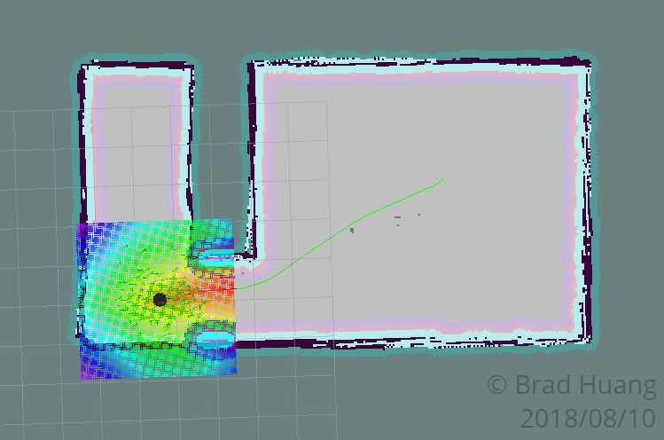
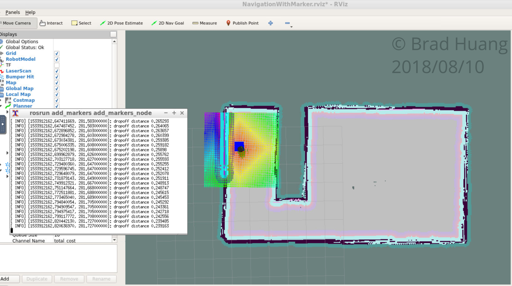

# Home Service Robot
This project is the final project of the Udacity Robotics Software Engineer Nanodegree. For the project, I created several ROS packages supported by ROS libraries to simulate a home service robot performing pick up and drop off operations in a home-style environment.

## Installation & Build
### ROS Kinetic
The project was developed on Ubuntu 16.04 LTS with [ROS Kinetic](http://wiki.ros.org/kinetic), [Gazebo](http://gazebosim.org/) and [catkin](http://wiki.ros.org/catkin) installed. Other dependencies can be installed through ``rosdep`` after the supporting packages have been cloned from Github.

### Supporting Packages
First, there are four supporting packages to install for the project.
- [slam_gmapping](http://wiki.ros.org/slam_gmapping) provides SLAM capability in conjunction with the gmapping package.
- [turtlebot](http://wiki.ros.org/turtlebot) provides underlying drivers and specifications for the Turtlebot 2 in ROS Kinetic, and also keyboard control functionality for this project.
- [turtlebot_interactions](http://wiki.ros.org/turtlebot_interactions) provides the RViz launcher scripts.
- [turtlebot_simulator](http://wiki.ros.org/turtlebot_simulator) connects the Turtlebot packages with the Gazebo environment.

### ``rosdep`` Dependencies
After cloning the supporting package in ``catkin_ws/src``, run ``rosdep`` on each of the package names to install their dependencies.

``rosdep -i install gmapping``

``rosdep -i install turtlebot``

If these commands do not work, or the project cannot be compiled afterwards, try to use ``apt-get`` to install these packages: ``ros-kinetic-turtlebot`` ``ros-kinetic-openslam-gmapping``.

### Building the Workspace
Use ``catkin`` to build the packages from source. From ``catkin_ws``, run:

``catkin_make; source devel/setup.bash``

to build the workspace packages and add them to the paths of ROS.

### Running the Scripts
After the above steps, you should be able to run each of the shell scripts in the ``ShellScripts`` directory.

## Project Content
### Directory Structure
The project repository contains source code of a ``catkin`` workspace and some map and world files for the simulation of the home service robot. Besides the supporting ROS packages described in the previous section, there are also three packages with custom ROS node in the ``src`` directory:
- ``wall_follower`` uses a modified script provided by Udacity to instruct the robot to traverse around the room while following the walls using laser scan data.
- ``pick_objects`` is a node that publish static goals to the goal topic and thus directs the robot through the navigation packages.
- ``add_markers`` contains two nodes that publishes markers in RViz. The ``add_constant_markers_node`` publishes markers at the goal positions with constant time intervals, while the ``add_markers_node`` publishes the markers in response to the robot's movements in the environment. Note how the second node uses the ``MarkerAdder`` class that inherits from the ``CustomMarkerAdder`` class used in the first node!

Besides the packages, the repository also contains supporting files:
- ``RVizConfig`` contains the config file for RViz that extends the RViz launcher's config file from ``turtlebot_interactions`` to include markers.
- ``World`` includes a house model built in Gazebo's Building Editor, and a map produced from the robot performing SLAM in the house.
- ``ShellScripts`` contains all the composite scripts to run each task of the project, and also supporting XML launch files ``amcl_demo.launch``, ``gmapping_demo.launch`` and ``view_navigation.launch`` with customized parameters.

### Tasks
The robot can perform a few tasks with the shell scripts. 
#### Test Slam
The ``test_slam.sh`` script simply launches Gazebo with the home environment, places a turtlebot in it and launches the ``slam_gmapping`` nodes. The user can move the robot in the environment using keyboard as in ``turtlebot_teleop``. Run this script to verify that the packages and dependencies have been installed correctly.

#### Wall Follower
The ``wall_follower.sh`` script differs from the ``test_slam.sh`` script in that the robot would be able to move autonomously around the room without and user input using the ``wall_follower`` node.

Map produced by performing SLAM while following walls:

#### Test Navigation
The ``tesst_navigation.sh`` script builds on top of the ``test_slam.sh`` script and enables the robot to reach a goal pose designated by the user in RViz through the ``amcl`` package.

Robot planning to reach the goal in RViz:

#### Pick Objects
The ``pick_objects.sh`` script assigns two goal poses to the robot consecutively as the robot traverses through the environment to simulate picking up objects from a location and dropping them off to another location.

Robot reaching the dropoff location:

#### Add Marker
The ``add_marker.sh`` script adds markers to the goal positions at constant times programmatically as the robot moves through the environment.

#### Home Service
The final script ``home_service.sh`` adds goal markers only when the robot is reaching the pick up and drop off locations by listening to the odometry topic.

Robot reaching the dropoff location while showing the marker:

